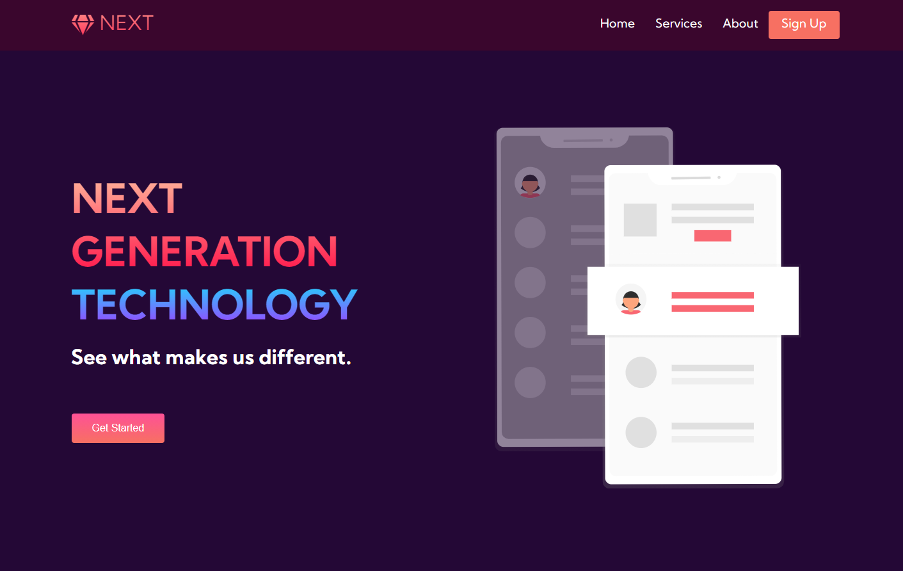

<!-- PROJECT LOGO -->
 

  

  <h3 align="center">Next Website </h3>

  

A Static Website For An AI Company    
    <a href="https://github.com/RemonMatthias/Next-Static-Website"><strong>Explore the docs »</strong></a>
     
     
    <a href="https://next-static-website-d7a1d.web.app/">View Demo</a>

  

<!-- TABLE OF CONTENTS -->

  
Table of Contents

  <ol>
    <li>
      <a href="#about-the-project">About The Project</a>
      <ul>
        <li><a href="#built-with">Built With</a></li>
      </ul>
    </li>
    <li><a href="#author">Author</a></li>
  </ol>

<!-- ABOUT THE PROJECT -->

## About The Project

    

Next is a very simple static landing page , it has a simple yet elegant and modern design. Implementing the super powers of a css preprocessor like "Sass" , by using utility classes and variables along with an organized and clean HTML markup following best practices.

### Built With

Next has been built using modern technologies such as :

- [HTML]()
- [Sass](https://sass-lang.com/)
- [Javascript](https://www.javascript.com/)

## Author

**Remon Matthias**

- [Profile](https://github.com/RemonMatthias)
- [Email](remonmatthias.business@gmail.com)
- [Website]("Welcome")
